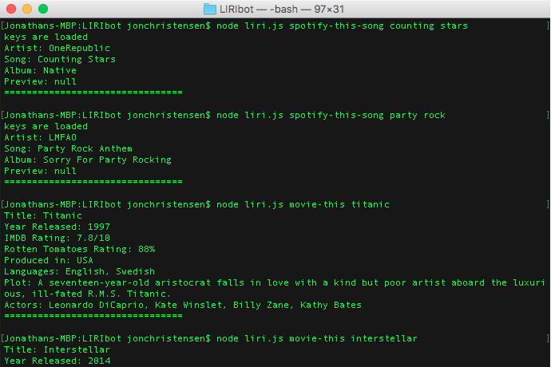

# LIRIbot
LIRIbot is a Node.js based application that executes certain commands passed to it via command line interface.

## Description

LIRIbot is a Language Interpretation and Recognition Interface application. LIRIbot is executed in Bash via Node.js, and will execute the command passed to it via process.argv. The supported commmands are as follows:

		my-tweets: lists the twenty most recent tweets from the linked Twitter account
		spotify-this-song: prints details from Spotify for the song submitted following this command
		movie-this: prints details from OMDB for the movie submitted following this command
		do-what-it-says: executes the command listed in the random.txt file
		play-this-song: opens the Spotify preview in the default browser for the song submitted following this command

By default, LIRIbot prints to the command line interface; however, it is possible to set it to print to log.txt by specifying '.true' at the end of all commands.

### Development

This application was developed as part of the GW Coding Bootcamp and was completed at the end of the fifth week.

### Organization

To run the application locally on your own computer, you can run the following in command line, replacing COMMAND with the desired process.

		git clone https://github.com/jonchr/LIRIbot.git
		cd LIRIbot
		node liri.js COMMAND

## Screenshots
### Examples of LIRIbot commands
